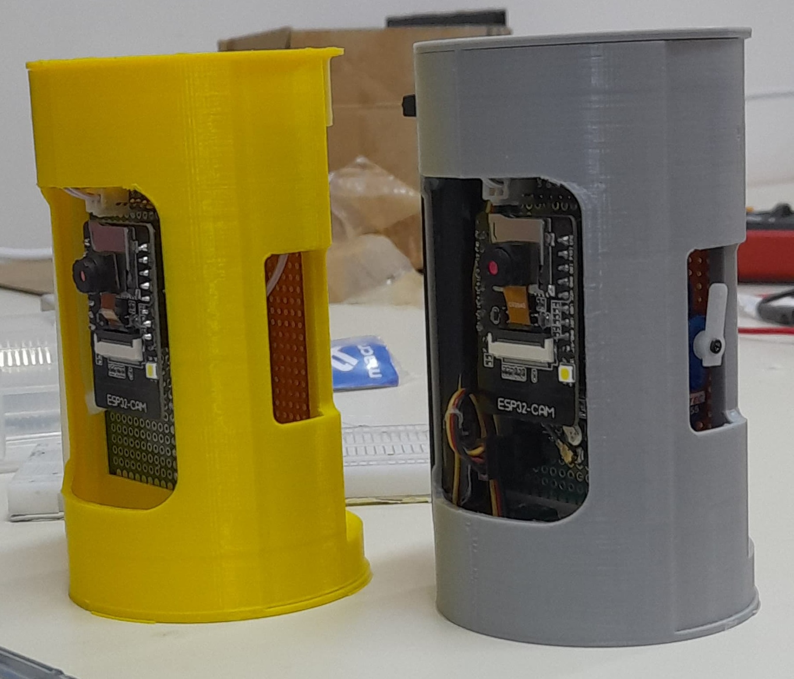
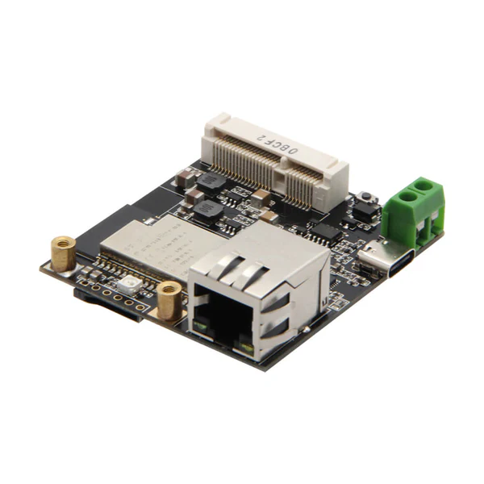
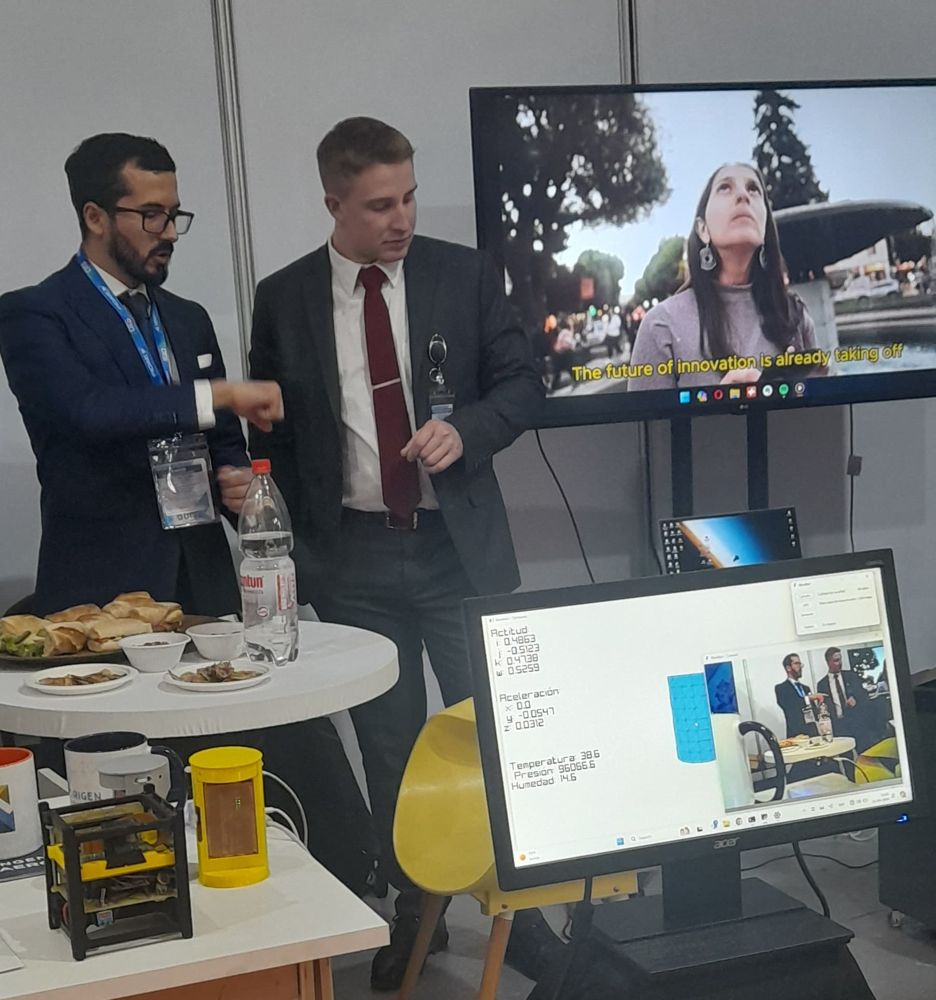

# ESP32

Mini resumen de su vida

## Cansat

### Componentes

#### Microcontrolador principal

Ai-Thinker ESP32-CAM

Copia de aliexpress de la version Ai-Thinker, incluye una cámara y ranura para tarjeta SD, utiles para la grabación y registro de datos en vuelo.

#### Sensores

##### BME680

Ofrece lecturas de temperatura, presión y humedad. Conectado por I2C y programado con la libreria de BOSCH.

##### BNO080

Sistema integrado de acelerómetro, magnetómetro y giroscopio. Realiza su propia fusión de sensores para entregar un cuaternión de orientación y aceleración lineal con o sin gravedad.

##### ATGM336H

GPS pequeño conectado por serial.

##### Lilygo T-BAT

Módulo de energía con ranura para una batería 18650.

#### Actuador

##### Servo SG90

Conectado a un elástico que sostiene una tapa lateral para que al soltarlo se despliegue un paracaídas. Por falta de tiempo no se alcanzó a implementar.

## Estación en tierra

### Componentes

#### Microcontrolador principal

Lilygo T-Internet-COM

Vendido por el mismo fabricante en Aliexpress. Basado en el ESP32 básico recibe la información y la retransmite por el puerto Ethernet a un computador. Esto porque la conexión serial es demasiado lenta para la cantidad de datos que se reciben por wifi.

## FIDAE

El Cansat fue expuesto en la FIDAE 2024 como relleno para el stand, a pesar de lo crudo que estaba en desarrollo (se terminó de programar la demo en la mañana del segundo día de exposición) la gente demostró interés y generó discusión sobre el trabajo con estas tecnologías en universidades o colegios.

### Resultados

La conexión por wifi con paquetes en modo "promiscuo" fue exitosa, un avance que se aprendio con el Cansat anterior que tambien funcionaba de la misma manera. En FIDAE había **mucha** intereferencia en la banda de 2.4GHz y una conexión normal hubiese fallado.

En la demo se presentaba un modelo 3D del Cansat que reflejaba la orientación entregada por el sensor de actitud, se imprimían lecturas de aceleración y condiciones ambientales además de mostrar el video en vivo. Esta demostración logró generar interés sobre que es lo que se está haciendo en la universidad.

El trabajo con microcontroladores ESP32 es también significativo porque estos se están utilizando mucho para este tipo de proyectos (con globos aerostáticos). En comparación con Arduino tienen el mismo costo, son solo un poco más difíciles de programar y ofrecen órdenes de magnitud mayor capacidad de procesamiento y por lo tanto aplicaciones que se les puede dar. El video en vivo es un ejemplo.

### Problemas a tratar en la siguiente iteración

#### Falta de pines en el ESP32-CAM

El ESP32-CAM tiene muy pocos pines disponibles para utilizar. Si se activa la cámara y la interfaz con tarjeta SD solo queda libre un par de pines para la comunicación I2C y nada más. Se intentó conectar el servo, pero siempre ocurría una interferencia en las líneas con otro componente que ya la estuviese ocupando.

#### Baja confiabilidad de enlace

Si bien en FIDAE se logro conectar, el enlace funcionaba solo si estaban a hasta 10 centímetros de distancia la estación en tierra con el CANSAT, más alla y se perdía toda la comunicación. Las causas son la interefencia presente en la feria pero también la implementación del modo promiscuo.

El modo promiscuo es la creación de paquetes wifi que siguen parte de la normativa IEEE 802.11 pero no completamente. En una aplicación normal ambos terminales wifi intercambian nombre de la red y contraseña y luego comienzan a transmitir información. En el modo promiscuo se salta esta parte y los terminales inundan el ambiente con paquetes de datos. El omitir el handshake de conexión reduce los tiempos de espera para reanudar una conexión en caso de perdida, pero no cumple con el estandar por lo que es algo a lo que los fabricantes no le dan mucho soporte, incluyendo Espressif. Al no tener soporte los intentos para solucionar problemas de conexión pasan a ser trabajo experimental lo cual se escapa un poco de lo que abarca el proyecto.

#### Implementación del paracaídas

Aun falta ver el diseño que tendrá la tapa y como estará conectado el elástico.

#### Interruptor

El módulo de energía utilizado no incluye una interfaz para un interruptor por lo que para apagar el Cansat se debe quitar la batería, algo más o menos difícil en el reducido espacio.
