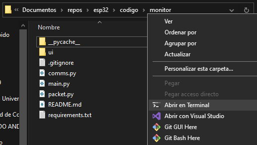

# Monitor

Programa de estación en tierra con el propósito de monitorear y llevar un registro de vuelo local del satélite. La información es proporcionada por el microcontrolador en tierra que retransmite los datos recibidos al puerto Ethernet del computador.

### Funcionalidad

- [x] Decodificar mensajes recibidos del satélite
- [x] Mostrar estado de la conexión (RSSI, velocidad)
- [ ] Codificar y enviar mensajes al satélite
- [ ] Mostrar información de sensores
  - [ ] IMU
  - [ ] Ambiente
  - [ ] GPS
  - [x] Cámara
- [ ] Grabar información de sensores

### Ejecutar

#### Prerequisitos

1. [Windows Terminal](https://aka.ms/terminal)

2. [Python](https://www.python.org/downloads/windows/)

3. [Repositorio](https://github.com/gisat-udec/esp32/archive/refs/heads/main.zip)

#### Instrucciones

1. Descomprimir archivos del repositorio y dirigirse a la carpeta "monitor", con click derecho "Abrir en Terminal"

2. Instalar dependencias de Python con comando `pip install -r requirements.txt`

3. Ejecutar codigo con `python main.py`

### Librerías

El programa está escrito en Python 3 con las librerías [Tkinter](https://docs.python.org/3/library/tkinter.html) para generar la interfaz gráfica y [asyncio](https://docs.python.org/3/library/asyncio.html) para la comunicación con el microcontrolador en tierra de manera asincrónica, ver `requirements.txt` para revisar todas las dependencias.